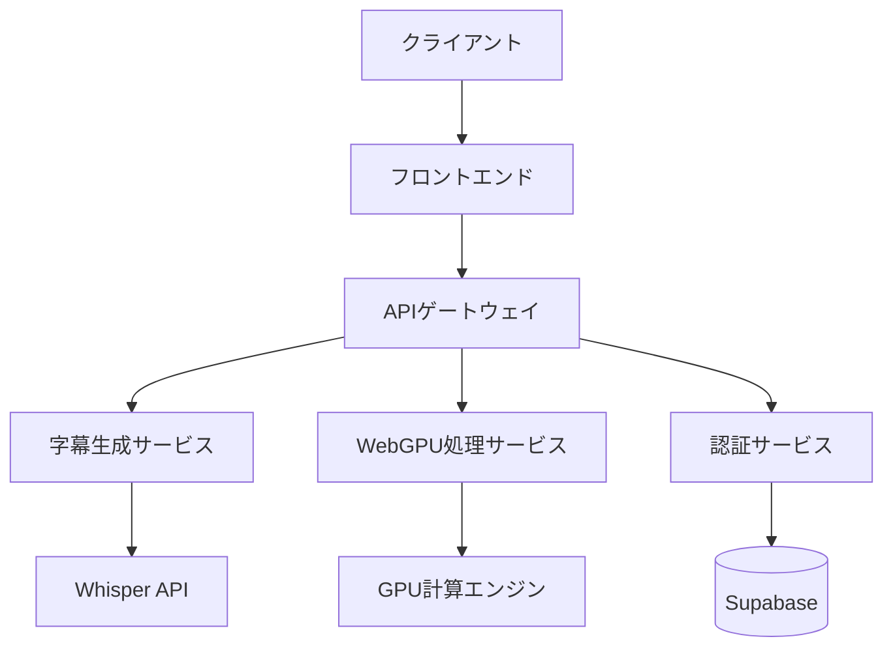
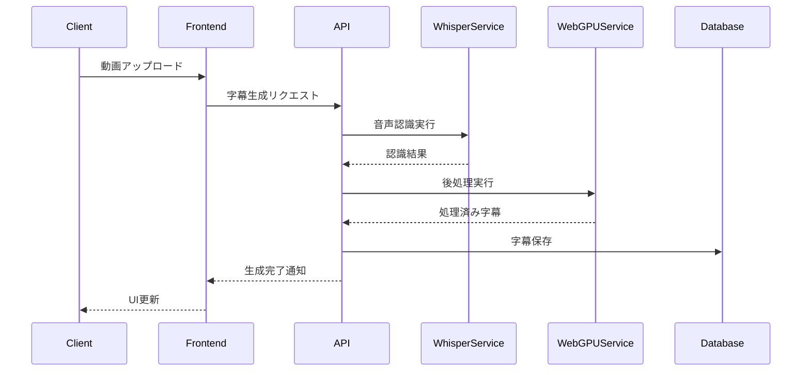
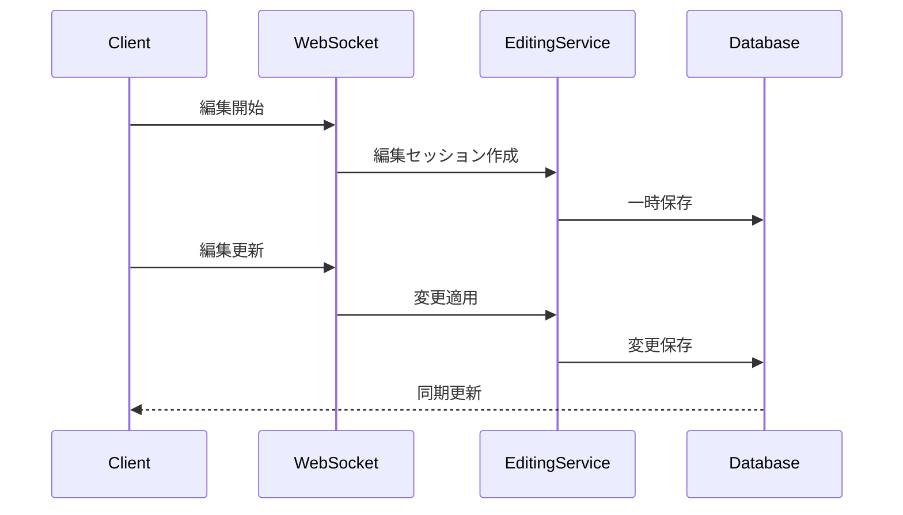

# アーキテクチャドキュメント

## 目次

1. [システム概要](#システム概要)
2. [アーキテクチャの原則](#アーキテクチャの原則)
3. [技術スタック](#技術スタック)
4. [システム構成](#システム構成)
5. [データフロー](#データフロー)
6. [セキュリティ](#セキュリティ)
7. [スケーラビリティ](#スケーラビリティ)

## システム概要

Sub Jiro Generatorは、WebGPUを活用した高性能な字幕生成・編集システムです。
システムは以下の主要コンポーネントで構成されています：

1. フロントエンド（React + TypeScript）
2. バックエンド（Node.js + Express）
3. WebGPU処理エンジン
4. Whisper音声認識サービス
5. データストア（Supabase）

## アーキテクチャの原則

### 1. マイクロサービスアーキテクチャ

- 独立したサービスとしての展開
- サービス間の疎結合
- 個別のスケーリング可能性

### 2. イベント駆動アーキテクチャ

- 非同期処理の活用
- WebSocketによるリアルタイム通信
- イベントバスによるサービス間通信

### 3. クリーンアーキテクチャ

```
src/
├── domain/          # ビジネスロジックとエンティティ
├── application/     # ユースケースとアプリケーションサービス
├── infrastructure/  # 外部サービスとの統合
└── presentation/    # UI層とAPI
```

## 技術スタック

### フロントエンド

- **フレームワーク**: React 18
- **言語**: TypeScript 5
- **状態管理**: Jotai
- **スタイリング**: Tailwind CSS
- **ビルドツール**: Vite

### バックエンド

- **ランタイム**: Node.js 18
- **フレームワーク**: Express
- **API**: REST + WebSocket
- **データベース**: Supabase (PostgreSQL)

### インフラストラクチャ

- **クラウド**: Vercel + Cloudflare
- **CI/CD**: GitHub Actions
- **モニタリング**: Datadog
- **ロギング**: CloudWatch

## システム構成



### コンポーネント詳細

#### 1. フロントエンド

```typescript
// src/components/TranscriptionManager.tsx
interface Props {
  videoUrl: string;
  onTranscriptionComplete: (subtitles: Subtitle[]) => void;
}

const TranscriptionManager: React.FC<Props> = ({
  videoUrl,
  onTranscriptionComplete,
}) => {
  const [status, setStatus] = useState<TranscriptionStatus>('idle');
  const [progress, setProgress] = useState(0);

  // WebSocket接続の管理
  useEffect(() => {
    const ws = new WebSocket(WS_ENDPOINT);
    ws.onmessage = (event) => {
      const data = JSON.parse(event.data);
      updateTranscriptionProgress(data);
    };
    return () => ws.close();
  }, []);

  return (
    <div className="transcription-manager">
      <VideoPlayer url={videoUrl} />
      <ProgressIndicator value={progress} />
      <SubtitleEditor onUpdate={handleSubtitleUpdate} />
    </div>
  );
};
```

#### 2. WebGPU処理サービス

```typescript
// src/services/WebGPUService.ts
class WebGPUService {
  private device: GPUDevice;
  private queue: GPUQueue;

  async initialize(): Promise<void> {
    const adapter = await navigator.gpu.requestAdapter();
    this.device = await adapter.requestDevice();
    this.queue = this.device.queue;
  }

  async computeParallel(data: Float32Array): Promise<Float32Array> {
    const shader = `
      @compute @workgroup_size(64)
      fn main(@builtin(global_invocation_id) global_id: vec3<u32>) {
        // 並列処理ロジック
      }
    `;

    const pipeline = await this.device.createComputePipeline({
      layout: 'auto',
      compute: {
        module: this.device.createShaderModule({
          code: shader,
        }),
        entryPoint: 'main',
      },
    });

    // バッファの設定と実行
    return this.executeCompute(pipeline, data);
  }
}
```

#### 3. 字幕生成サービス

```typescript
// src/services/TranscriptionService.ts
class TranscriptionService {
  private whisperClient: WhisperClient;
  private webGPUService: WebGPUService;

  async transcribe(audioData: ArrayBuffer): Promise<Subtitle[]> {
    // 音声認識の実行
    const rawTranscription = await this.whisperClient.transcribe(audioData);

    // WebGPUによる後処理
    const enhancedTranscription = await this.webGPUService.enhanceTranscription(
      rawTranscription
    );

    return this.formatSubtitles(enhancedTranscription);
  }

  private async formatSubtitles(
    transcription: RawTranscription
  ): Promise<Subtitle[]> {
    // 字幕フォーマットの最適化
    return transcription.segments.map(segment => ({
      id: generateId(),
      startTime: segment.start,
      endTime: segment.end,
      text: segment.text,
    }));
  }
}
```

## データフロー

### 1. 字幕生成フロー



### 2. リアルタイム編集フロー



## セキュリティ

### 1. 認証・認可

```typescript
// src/middleware/auth.ts
export const authMiddleware = async (
  req: Request,
  res: Response,
  next: NextFunction
) => {
  try {
    const token = req.headers.authorization?.split(' ')[1];
    if (!token) {
      throw new UnauthorizedError();
    }

    const user = await verifyToken(token);
    req.user = user;
    next();
  } catch (error) {
    next(error);
  }
};
```

### 2. データ暗号化

```typescript
// src/services/EncryptionService.ts
class EncryptionService {
  private readonly algorithm = 'AES-GCM';
  private readonly keyLength = 256;

  async encrypt(data: string): Promise<EncryptedData> {
    const key = await this.generateKey();
    const iv = crypto.getRandomValues(new Uint8Array(12));
    const encoded = new TextEncoder().encode(data);

    const ciphertext = await crypto.subtle.encrypt(
      {
        name: this.algorithm,
        iv,
      },
      key,
      encoded
    );

    return {
      ciphertext: Buffer.from(ciphertext).toString('base64'),
      iv: Buffer.from(iv).toString('base64'),
    };
  }
}
```

## スケーラビリティ

### 1. 水平スケーリング

- Kubernetes上でのマイクロサービスデプロイ
- オートスケーリングの設定
- ロードバランシング

### 2. キャッシュ戦略

```typescript
// src/services/CacheService.ts
class CacheService {
  private readonly redis: Redis;
  private readonly defaultTTL = 3600; // 1時間

  async get<T>(key: string): Promise<T | null> {
    const cached = await this.redis.get(key);
    return cached ? JSON.parse(cached) : null;
  }

  async set<T>(key: string, value: T, ttl = this.defaultTTL): Promise<void> {
    await this.redis.set(key, JSON.stringify(value), 'EX', ttl);
  }
}
```

### 3. バッチ処理

```typescript
// src/services/BatchProcessor.ts
class BatchProcessor {
  private readonly batchSize = 100;
  private queue: Job[] = [];

  async addJob(job: Job): Promise<void> {
    this.queue.push(job);
    if (this.queue.length >= this.batchSize) {
      await this.processBatch();
    }
  }

  private async processBatch(): Promise<void> {
    const batch = this.queue.splice(0, this.batchSize);
    await Promise.all(
      batch.map(job => this.processJob(job))
    );
  }
}
```

## パフォーマンス最適化

### 1. WebGPU最適化

```typescript
// src/services/WebGPUOptimizer.ts
class WebGPUOptimizer {
  private readonly workgroupSize = 64;

  async optimizeShader(shader: string): Promise<string> {
    // シェーダーコードの最適化
    return this.applyOptimizations(shader);
  }

  private calculateOptimalWorkgroupSize(dataSize: number): number {
    return Math.min(
      this.workgroupSize,
      Math.pow(2, Math.floor(Math.log2(dataSize)))
    );
  }
}
```

### 2. メモリ管理

```typescript
// src/services/MemoryManager.ts
class MemoryManager {
  private readonly maxBufferSize = 1024 * 1024; // 1MB

  async allocateBuffer(size: number): Promise<GPUBuffer> {
    if (size > this.maxBufferSize) {
      return this.allocateChunked(size);
    }
    return this.allocateSingle(size);
  }

  private async releaseBuffer(buffer: GPUBuffer): Promise<void> {
    buffer.destroy();
  }
}
```

## 監視とロギング

### 1. パフォーマンスモニタリング

```typescript
// src/monitoring/PerformanceMonitor.ts
class PerformanceMonitor {
  private metrics: Metrics = {
    transcriptionTime: [],
    gpuProcessingTime: [],
    memoryUsage: [],
  };

  trackTranscription(duration: number): void {
    this.metrics.transcriptionTime.push({
      timestamp: Date.now(),
      duration,
    });
  }

  generateReport(): PerformanceReport {
    return {
      averageTranscriptionTime: this.calculateAverage(
        this.metrics.transcriptionTime
      ),
      averageGPUProcessingTime: this.calculateAverage(
        this.metrics.gpuProcessingTime
      ),
      memoryTrend: this.analyzeMemoryTrend(),
    };
  }
}
```

### 2. エラー追跡

```typescript
// src/monitoring/ErrorTracker.ts
class ErrorTracker {
  private readonly sentry: Sentry;

  trackError(error: Error, context?: ErrorContext): void {
    this.sentry.captureException(error, {
      extra: context,
      tags: {
        environment: process.env.NODE_ENV,
        component: context?.component,
      },
    });
  }
}
```

## 将来の拡張性

1. 新しい音声認識モデルの統合
2. マルチGPUサポート
3. エッジコンピューティングの活用
4. AI強化による字幕品質の向上

## 参考資料

- [WebGPU仕様](https://www.w3.org/TR/webgpu/)
- [Whisper API文書](https://platform.openai.com/docs/guides/speech-to-text)
- [React Performance](https://reactjs.org/docs/optimizing-performance.html)
- [マイクロサービスパターン](https://microservices.io/patterns/) 